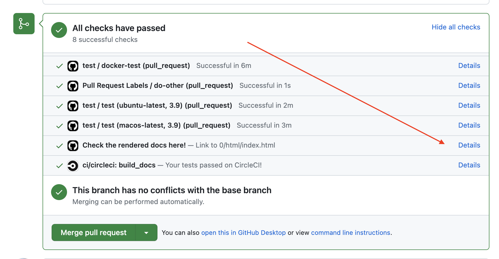
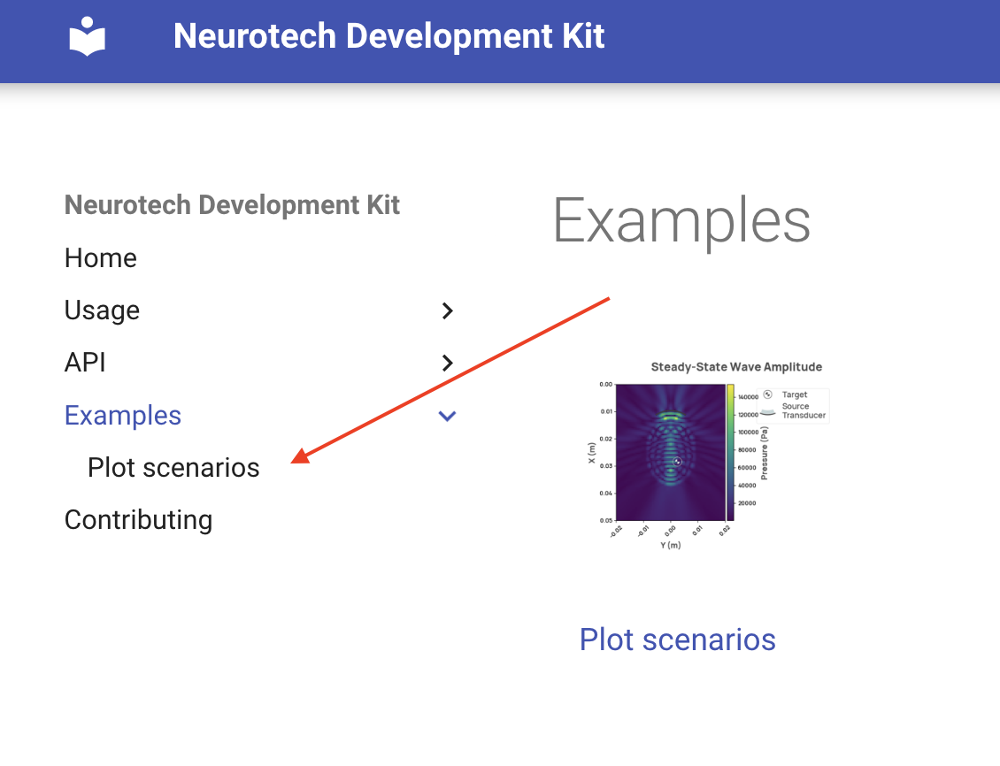

# Contributing

You can contribute to NDK by creating GitHub issues or by submitting pull requests.

## Reporting issues

Feel free to open an issue if you would like to discuss a new feature request or report a bug. When creating a bug report, please include as much information as possible to help us reproduce the bug as well as what the actual and expected behavior is.

## Contributing code

### Standards

To ensure efficient collaborative development, a variety of standards are utilized in this project.

- [Black](https://github.com/psf/black) code formatter is used.
- [Flake8](https://flake8.pycqa.org) is used for linting.
- [isort](https://pycqa.github.io/isort/) is used for sorting the imports.
- [pyright](https://github.com/microsoft/pyright) is used for static type checking.
- [Type hinting](https://docs.python.org/3/library/typing.html) is used.
      - And checked using [mypy](http://mypy-lang.org).

### Preparing your environment

Start by cloning the repository:

```
git clone https://github.com/agencyenterprise/neurotechdevkit.git
cd neurotechdevkit
```

#### Running on docker

If you don't want to install NDK's dependencies on your machine, you can run it in a container:

* Install [Docker](https://docs.docker.com/engine/install/#desktop).

* Run the container, which will start a jupyter notebook server:
   ```
   git clone https://github.com/agencyenterprise/neurotechdevkit.git
   cd neurotechdevkit
   docker compose up
   ```

* Connect to the jupyter notebook directly in your browser or with your IDE.

#### Running locally

This project requires Python `>=3.9` and `<3.11` to be installed. You can find the Python version you have installed by running `python --version` in a terminal. If you don't have Python installed or are running an unsupported version, you can download a supported version from [python.org](https://www.python.org/downloads/).

We use [poetry](https://python-poetry.org/) to manage dependencies and virtual environments. Follow the instructions from [poetry's documentation](https://python-poetry.org/docs/#installation) to install it if you don't have it on your system.

Install the dependencies by running the following command in a shell within the project directory:

```
poetry install
```

This will resolve and install the dependencies from `poetry.lock` and will install the `neurotechdevkit` package in editable mode.


Install stride with

```bash
$ poetry run pip install git+https://github.com/trustimaging/stride
```

`devito`, a dependency of `neurotechdevkit`, requires `libomp`. On MacOS it can be installed with:

```
brew install libomp
```

the output of the command above will look like this:

```
For compilers to find libomp you may need to set:
export LDFLAGS="-L/usr/local/opt/libomp/lib"
export CPPFLAGS="-I/usr/local/opt/libomp/include"
```

`devito` requires the directory with `libomp` headers to be accessible during the runtime compilation, you can make it accessible by exporting a new environment variable `CPATH` with the path for libomp headers, like so:

```
export CPATH="/usr/local/opt/libomp/include"
```

You will also have to set an environment variable that defines what compiler `devito` will use, like so:

```
export DEVITO_ARCH=gcc
```

the supported values for `DEVITO_ARCH` are: `'custom', 'gnu', 'gcc', 'clang', 'aomp', 'pgcc', 'pgi', 'nvc', 'nvc++', 'nvidia', 'cuda', 'osx', 'intel', 'icpc', 'icc', 'intel-knl', 'knl', 'dpcpp', 'gcc-4.9', 'gcc-5', 'gcc-6', 'gcc-7', 'gcc-8', 'gcc-9', 'gcc-10', 'gcc-11'`


### Using the environment

If you are not already using a virtual environment, `poetry` will [create one for you by default](https://python-poetry.org/docs/basic-usage/#using-your-virtual-environment). You will need to use this virtual env when using or working on the package.

Activate the environment directly via:

```
poetry shell
```

If you are already using your own virtual environment, you should not need to change anything.

## Code requirements and conventions

!!! note
      The following commands require `GNU make` to be installed, on Windows you can install it with [Chocolatey](https://chocolatey.org/install):

      `choco install make`

Before opening a pull request, please make sure that all of the following requirements are met:

1. all unit and integration tests are passing:
   ```
   make test
   ```
1. the code is linted and formatted:
   ```
   make lint
   ```
1. type hinting is used on all function and method parameters and return values, excluding tests
1. docstring usage conforms to the following:
      1. all docstrings should follow [PEP257 Docstring Conventions](https://peps.python.org/pep-0257/)
      2. all public API classes, functions, methods, and properties have docstrings and follow the [Google Python Style Guide](https://github.com/google/styleguide/blob/gh-pages/pyguide.md#38-comments-and-docstrings)
      3. docstrings on private objects are not required, but are encouraged where they would significantly aid understanding
1. testing is done using the pytest library, and test coverage should not unnecessarily decrease.


## Process

### Versioning

NDK uses [semantic versioning](https://en.wikipedia.org/wiki/Software_versioning#Semantic_versioning) to identify its releases.

We use the [release on push](https://github.com/rymndhng/release-on-push-action/tree/master/) github action to generate the new version for each release. This github action generates the version based on a pull request label assigned before merge. The supported labels are:

- `release-patch`
- `release-minor`
- `release-major`
- `norelease`

### Automatic release

Merged pull requests with one of the labels `release-patch`, `release-minor` or `release-major` will trigger a release job on CI.

The release job will:

1. generate a new package version using semantic versioning provided by [release on push](https://github.com/rymndhng/release-on-push-action/tree/master/)
1. update the `pyproject.toml` version using `poetry`
1. commit the updated `pyproject.toml` file using the [git-auto-commit action](https://github.com/stefanzweifel/git-auto-commit-action/tree/v4/)
1. push the package to pypi using [poetry publish](JRubics/poetry-publish@v1.16)
1. build a new docker image and tag it with the previously generated semantic version

Pull requests merged with the tag `norelease` will not trigger any of the actions listed above.

### Checking NDK documentation on CI

All pull requests trigger a CI job that builds the documentation and makes the built files available.

To check the generated documentation in a pull request:

1. Scroll to the bottom of the page and click on the `Show all checks` link.
1. Click on the details link of the `Check the rendered docs here!` job.
      <figure markdown>
            { width="800" }
      </figure>

!!! note
      The `Examples` section is not properly rendered when the documentation is built
      on CI. The links of the thumbnails in `gallery/index.html` point to broken paths,
      in order to check one of the examples you will have to click on the left panel,
      as shown in the image below:
      <figure markdown>
            { width="500" }
      </figure>
      Within each example, the outputs of cells are also not properly displayed.