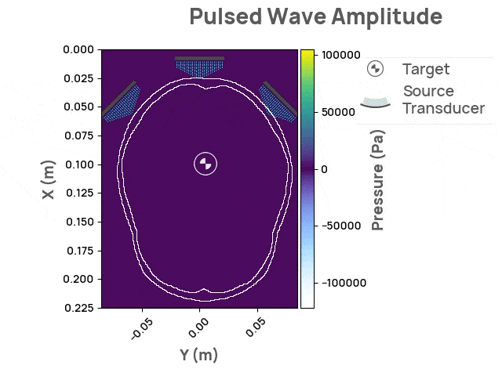
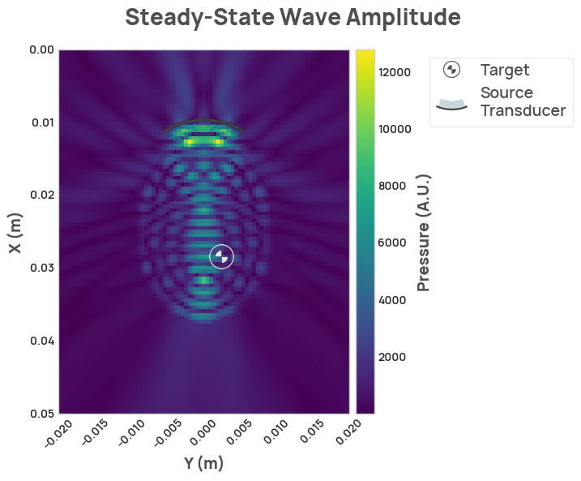

# Welcome to Neurotech Development Kit

The _Neurotech Development Kit_ (NDK) is an open-source software library designed to enhance accessibility to cutting-edge neurotechnology.
Featuring an easy-to-use API and pre-built examples, the NDK provides a seamless starting point for users.
Moreover, the NDK offers educational resources, such as interactive simulations and notebook-based tutorials, catering to a diverse audience including researchers, educators, engineers, and trainees.
By lowering the barrier of entry for newcomers and accelerating the progress of researchers, the NDK aims to be a versatile and invaluable tool for the neurotech community.

The initial set of target users for the NDK are ultrasound simulation trainees – individuals with backgrounds in technical or neuroscience-related fields who are learning to perform ultrasound simulations.
Our goal is to help users familiarize themselves with ultrasound simulation, understand the importance of input parameters, and streamline the process of running and visualizing simulations.
In the future, we plan to expand the NDK's features to incorporate additional functionality and modalities, catering to a broader range of users, including ultrasound researchers, product developers, machine learning engineers, and many more.

The initial release of NDK provides support for transcranial functional ultrasound stimulation, with a focus on providing comprehensive documentation, API flexibility, and visualizations.
The Neurotech Development Kit is actively developed and we welcome feedback and contributions.

<figure markdown>
  { width="900" }
</figure>

## Running

### Local installation

`neurotechdevkit` requires Python `>=3.9` and `<3.11` to be installed. You can find which Python version you have installed by running `python --version` in a terminal.

If you don't have Python installed, or you are running an unsupported version, you can download it from [python.org](https://www.python.org/downloads/). Python environment managers like pyenv, conda, and poetry are all perfectly suitable as well.

You can install the `neurotechdevkit` package using:

```bash
pip install neurotechdevkit
```

You also have to install stride, it can be done running:

```bash
pip install git+https://github.com/trustimaging/stride
```

`devito`, a dependency of `neurotechdevkit`, requires `libomp`. On MacOS it can be installed with:

```
brew install libomp
```

the output of the command above will look like this:

```
For compilers to find libomp you may need to set:
export LDFLAGS="-L/usr/local/opt/libomp/lib"
export CPPFLAGS="-I/usr/local/opt/libomp/include"
```

`devito` requires the directory with `libomp` headers to be accessible during the runtime compilation, you can make it accessible by exporting a new environment variable `CPATH` with the path for libomp headers, like so:

```
export CPATH="/usr/local/opt/libomp/include"
```

You will also have to set an environment variable that defines what compiler `devito` will use, like so:

```
export DEVITO_ARCH=gcc
```

the supported values for `DEVITO_ARCH` are: `'custom', 'gnu', 'gcc', 'clang', 'aomp', 'pgcc', 'pgi', 'nvc', 'nvc++', 'nvidia', 'cuda', 'osx', 'intel', 'icpc', 'icc', 'intel-knl', 'knl', 'dpcpp', 'gcc-4.9', 'gcc-5', 'gcc-6', 'gcc-7', 'gcc-8', 'gcc-9', 'gcc-10', 'gcc-11'`

### Docker

You can run `NDK` inside a docker container with a couple of steps:

1. Install [docker](https://docs.docker.com/engine/install/#desktop)

1. Execute `docker run -p 8888:8888 ghcr.io/agencyenterprise/neurotechdevkit:latest`

The output of the command above contains the URL of a jupyter notebook server, you can open the URL in your browser or connect to it using your IDE.

## Usage

```python
import neurotechdevkit as ndk

scenario = ndk.make('scenario-0-v0')
result = scenario.simulate_steady_state()
result.render_steady_state_amplitudes(show_material_outlines=False)
```

<figure markdown>
  { width="900" }
</figure>

### Acknowledgements

Thanks to Fred Ehrsam for supporting this project, Quintin Frerichs and Milan Cvitkovic for providing direction, and to Sumner Norman for his ultrasound and neuroscience expertise. Thanks to [Stride](https://www.stride.codes/) for facilitating ultrasound simulations, [Devito](https://www.devitoproject.org/) for providing the backend solver, [Napari](https://napari.org/stable/) for great 3D visualization, and to [Jean-Francois Aubry, et al.](https://doi.org/10.1121/10.0013426) for the basis of the simulation scenarios.
