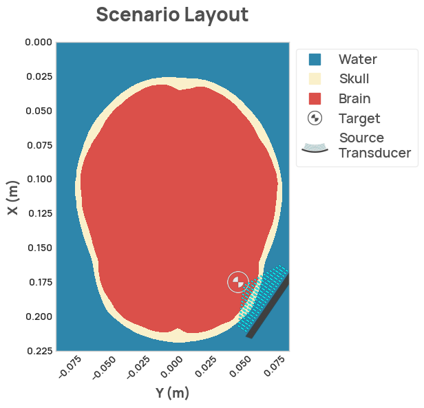

NDK provides a simple but flexible API to control the parameters of sources.
Users can specify the parameters and placement of sources, and add them to their simulation.

```py
import neurotechdevkit as ndk
import numpy as np

scenario = ndk.scenarios.built_in.ScenarioRealisticSkull_2D()

source = ndk.sources.FocusedSource2D(
    position=np.array([0.19, 0.07]),
    direction=np.array([-0.5, -1.]),
    aperture=0.06,
    focal_length=0.08,
    num_points=3000
)
scenario.sources = [source]

scenario.make_grid()
scenario.render_layout()
```

<figure markdown>
  { width="600" }
</figure>

In the visualization of the source, the `position` parameter of the source corresponds to the point located at the midpoint of the dark arc on the front (concave) edge. The `position` and `direction` of the source are accurately shown in the plot, while the `aperture` and `focal_length` (radius of curvature) of the rendered source approximately visualize what is defined in the source object. The blue dotted lines indicate the ultrasound waves.

Transducer locations are currently not constrained within the scenario or by materials, and so care needs to be taken when configuring a source so that it is not embedded inside the skull, for instance, or located outside of the simulation volume.

In the future, we plan to implement constraints to avoid overlapping with solid materials or other sources, and to also add helper utilities to assist with placing sources along the surface of the skull using fewer degrees of freedom.

If a source is not specified before the scenario is rendered or simulated, then a default source will be used. So you should add the source to the scenario before doing either of these operations (rendering or simulating).

!!! note
    The visualization of the source in 2D plots currently has some scaling limitations, and transducers with short focal lengths can appear very small. This only affects the visualization and not the simulation, and will be improved in future versions.

The implemented source options are:

- `FocusedSource2D`
- `FocusedSource3D`
- `PlanarSource2D`
- `PlanarSource3D`
- `PhasedArraySource2D`
- `PhasedArraySource3D`

The 2D sources are for 2D scenarios and the 3D sources for 3D scenarios. The parameters to configure the sources are identical between focused and planar sources, except that planar sources have a pre-defined focal length of `np.inf`.

```py
import neurotechdevkit as ndk
import numpy as np

scenario = ndk.scenarios.built_in.ScenarioRealisticSkull_2D()

source_position = np.array([0.19, 0.07])
source = ndk.sources.PlanarSource2D(
    position=source_position,
    direction=scenario.target_center - source_position,
    aperture=0.06,
    num_points=3000
)
scenario.sources = [source]

scenario.make_grid()

scenario.render_layout()
```

<figure markdown>
  { width="600" }
</figure>
