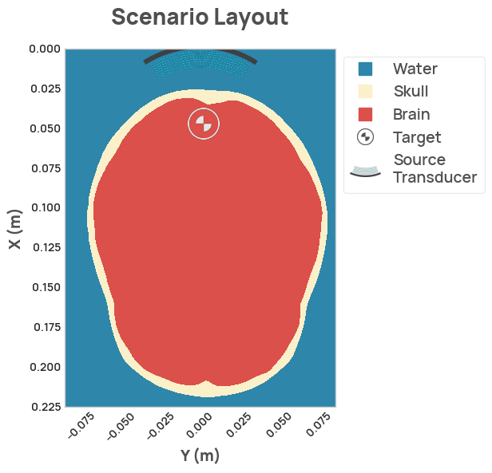

Scenarios provide a convenient structure to describe the environment, transducers, and sensors.
A collection of preconfigured scenarios are provided with NDK, and can be easily loaded.

There are currently three scenarios provided with NDK, two of which have both a 2D and 3D version.
2D versions are quick to simulate and are great for testing out ideas quickly before transferring to a 3D simulation.

The following is all that's needed to load a pre-defined scenario:

```py
import neurotechdevkit as ndk

scenario = ndk.scenarios.built_in.ScenarioRealisticSkull_2D()
scenario.make_grid()
```

The existing scenarios include:

- `SCENARIO_SIMPLE` (2D) - a simple quick-start toy scenario that enables users to dive in and experiment with their first simulation immediately.
- `SCENARIO_FLAT_SKULL_3D` (3D) - a scenario containing a flat 3-layer bone covered by skin, with water above the skin and brain below the bone. This is based on benchmark 4 of [Jean-Francois Aubry, et al.](https://doi.org/10.1121/10.0013426).
- `SCENARIO_REALISTIC_SKULL_3D` (3D) - a scenario containing a full skull and brain mesh immersed in water. This is based on benchmark 8 of [Jean-Francois Aubry, et al.](https://doi.org/10.1121/10.0013426).
- `SCENARIO_FLAT_SKULL_2D` (2D) - a 2D version of `SCENARIO_FLAT_SKULL`.
- `SCENARIO_REALISTIC_SKULL_2D` (2D) - a 2D version of `SCENARIO_REALISTIC_SKULL`.

All of these scenarios are immediately ready for visualization and simulation, with appropriate default parameters used where needed.

```py
scenario.render_layout()
```

<figure markdown>
  { width="600" }
</figure>
