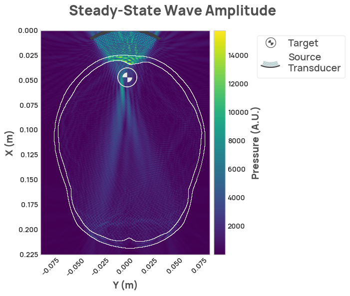

The Neurotech Development Kit provides support for a range of simulation modes, including pulsed simulation and steady-state simulation.

The following code shows how to run a simulation.

```py
import neurotechdevkit as ndk

scenario = ndk.scenarios.built_in.ScenarioRealisticSkull_2D()
scenario.make_grid()
scenario.compile_problem()
result = scenario.simulate_steady_state()
result.render_steady_state_amplitudes()
```

<figure markdown>
  { width="600" }
</figure>
