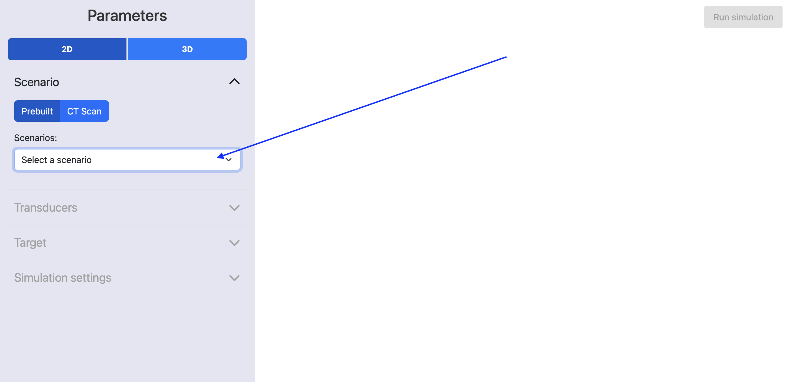

!!! note
    This functionality is currently under development.

# User Interface

Neurotech Development Kit has a built-in web server that allows you to create and run simulations using your web browser.


<figure markdown>
  { width="900" }
</figure>


## Running

There are multiple ways of running the web server, you can choose between:

### Pip

1. Follow the [installation tutorial](installation.md)

1. Open a terminal and execute

    ```
    ndk-ui
    ```

### Virtual environment

1. Follow the *running locally* section of the [contributing tutorial](contributing.md#running-locally)

1. Open a terminal in the project location and run the following command

    ```
    make web
    ```

### Docker

1. Install [Docker](https://docs.docker.com/engine/install/#desktop).

1. Open a terminal and run the following command:

   ```
   docker run -p 8080:8080 -e WEB_SERVER_HOST=0.0.0.0 -w "/ndk" -it ghcr.io/agencyenterprise/neurotechdevkit:latest python src/web/app.py
   ```


## Using

After executing the last step of any of the options described above you will be able to open the address `http://127.0.0.1:8080/` in your browser.

You should be able to select one of the pre-defined scenarios and see its layout:


<figure markdown>
  { width="900" }
</figure>


